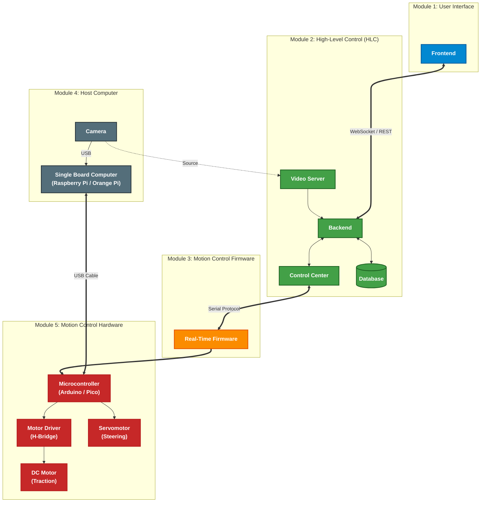

# gabriel-teleop-platform
# A Modular Heterogeneous Teleoperation Platform  

## About

Project Gabriel is a modular teleoperation architecture designed to control ground vehicles. The core philosophy is interchangeability: no single technology or hardware component is hard-coded into the architecture.

Every module, from the high-level web framework to the low-level motor driver, is treated as a "black box" defined solely by its inputs and outputs. This enables seamless substitution:

**Software Agnostic**

You can replace the Angular frontend with React or Vue, or rewrite the C++ backend in Rust or Go. As long as the new module respects the defined interfaces, the rest of the system remains unaffected.

**Hardware Independence**

The architecture does not demand specific boards. You can upgrade the Raspberry Pi (Module 4) to an NVIDIA Jetson for better AI performance, or swap the Arduino (Module 5) for an STM32 or ESP32. If the replacement implements the correct Serial Protocol and Pinout interface, it will function immediately.

## Architecture

The system is organized into 5 distinct modules:

**Module 1: User Interface (Web)**  
* A responsive, browser-based interface designed to provide an immersive, game-like teleoperation experience.
* Uses WebSocket for real-time video/telemetry and REST (Representational State Transfer) for configuration.  

**Module 2: High-Level Control Software (HLC)**  
* The "Brain" - runs on Module 4's Single Board Computer (SBC).  
* Components: Video Server, Backend, Control Center, Database.  
* Orchestrates user commands and video streaming.  

**[Module 3: Motion Control Firmware](docs/module3-motion-control-firmware.md)**  
* Real-time embedded software running on Module 5's Microcontroller (MCU).  
* Translates abstract commands into precise motor control signals.  

**Module 4: Host Computer (Hardware)**  
* Physical computing platform (SBC): Raspberry Pi/Orange Pi + Camera.  
* Executes Module 2 software and interfaces with Module 5 via USB.  

**Module 5: Motion Control Hardware**  
* The "Muscle" - MCU, motor drivers, servos, and motors.  
* Executes Module 3 firmware for hard real-time control.  

## Overview   



## Tech Stack (Base Implementation)

- **Module 1:** Angular
- **Module 2:** C++ (backend), C++ (video-server), C++ (control center) and PostgreSQL (database)  
- **Module 3:** AVR C (firmware)
- **Module 4:** Raspberry Pi 5 (SBC) and any USB camera
- **Module 5:** Arduino Uno


## Directory Structure

The repository follows a modular structure where each module has its own directory:

```
module<number>-<module-name>/
    <submodule>/
        <tech-choice-1>/
        <tech-choice-2>/
        ...
```

Each module directory contains subdirectories for submodules, which in turn contain different technology implementations. This allows the same module to be implemented in multiple programming languages or frameworks, reinforcing the platform's technology-agnostic philosophy.

**Examples:**
- `module1-user-interface/frontend/angular/` - Angular implementation
- `module1-user-interface/frontend/react/` - Alternative React implementation
- `module2-high-level-control/video-server/cpp/` - C++ video server implementation
- `module3-motion-control-firmware/avr-c/` - AVR C firmware
