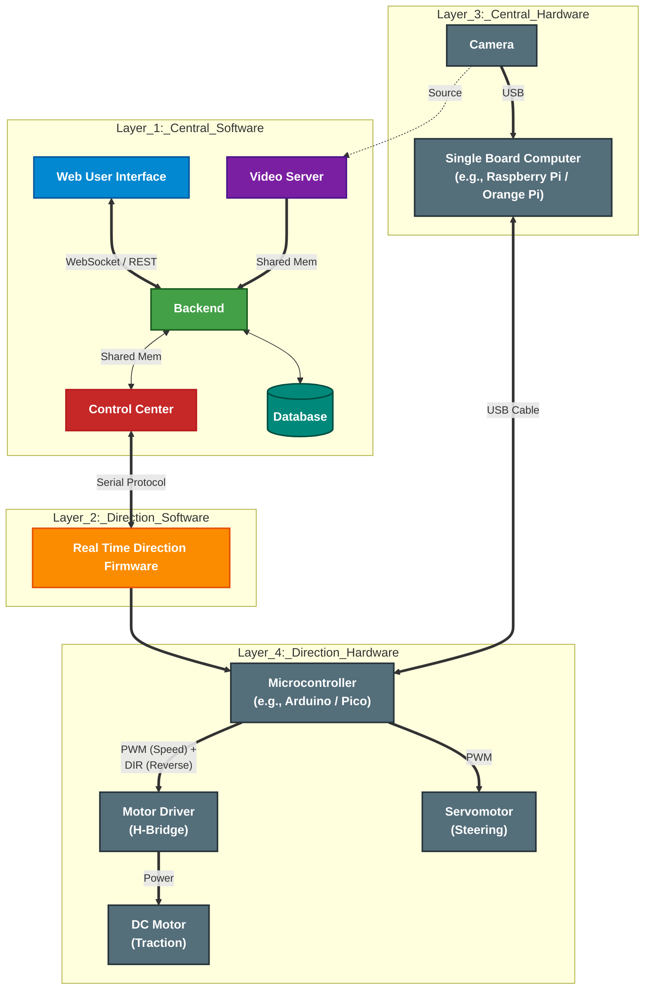

# gabriel-teleop-platform

A Modular Heterogeneous Teleoperation System

## About

Project Gabriel is a modular teleoperation architecture designed to control ground vehicles. The core philosophy is interchangeability: no single technology or hardware component is hard-coded into the architecture.

Every module, from the high-level web framework to the low-level motor driver, is treated as a "black box" defined solely by its inputs and outputs. This enables seamless substitution:

**Software Agnostic**

You can replace the Angular frontend with React or Vue, or rewrite the C++ backend in Rust or Go. As long as the new module respects the defined interfaces, the rest of the system remains unaffected.

**Hardware Independence**

The architecture does not demand specific boards. You can upgrade the Raspberry Pi (Layer 3) to an NVIDIA Jetson for better AI performance, or swap the Arduino (Layer 4) for an STM32 or ESP32. If the replacement implements the correct Serial Protocol and Pinout interface, it will function immediately.

## Overview   

## Architecture

The system is organized into 4 distinct layers, moving from high-level user interaction down to physical voltage modulation:

### Layer 1: Central Software

**Modules:**
- Web User Interface
- Video Server
- Backend  
- Control Center
- Database

**Purpose:** The "Brain" of the vehicle. It orchestrates the web dashboard (WebSocket/REST), video streaming, backend logic, and control coordination running on a Linux SBC.

### Layer 2: Direction Software

**Module:**
- Real Time Direction Firmware

**Purpose:** A dedicated Real-Time Firmware module that translates abstract commands (e.g., "Direction, Angle, Acceleration") into precise electrical signals, ensuring safety limits and smooth control.

### Layer 3: Central Hardware

**Modules:**
- Camera
- Single Board Computer (e.g., Raspberry Pi / Orange Pi)

**Purpose:** The physical computing cluster managing USB modules and camera input.

### Layer 4: Direction Hardware

**Modules:**
- Microcontroller (e.g., Arduino / Pico)
- Motor Driver (H-Bridge)
- Servomotor (Steering)
- DC Motor (Traction)

**Purpose:** The "Muscle" of the system. The MCU drives the H-Bridge Motor Drivers and Steering Servos via PWM and Direction signals, physically moving the chassis.

## Key Features

**Hybrid Networking**

Uses WebSockets for binary streaming (video/telemetry) and REST for state management.

**Zero-Copy Video**

Implementation of POSIX Shared Memory to pass frames from Camera to Web Server without redundant memory allocations.

**Hard Real-Time Safety**

Critical motor logic is offloaded to an MCU, ensuring the vehicle stops immediately if the Linux host freezes or crashes.

**Modular Hardware**

The separation of "Central Hardware" (L3) and "Direction Hardware" (L4) allows for easy swapping of chassis types (e.g., changing from DC motors to Brushless) without rewriting the host software.