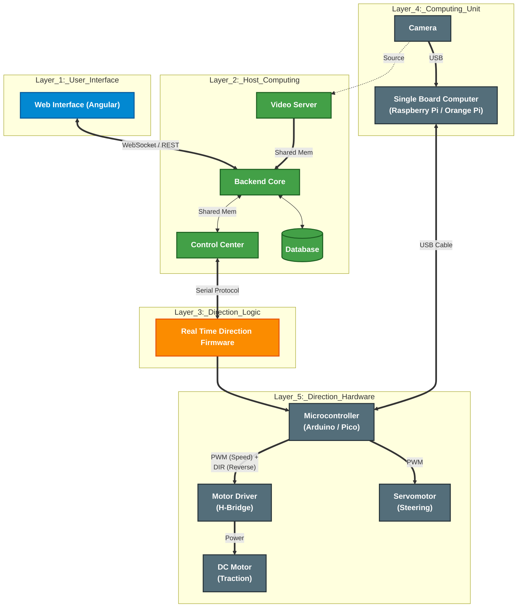

# gabriel-teleop-platform
A Modular Heterogeneous Teleoperation System

## Overview   

```mermaid
flowchart TD
    %% -- Styling --
    classDef class_ui fill:#0288d1,stroke:#01579b,stroke-width:2px,color:white,font-size:16px,font-weight:bold;
    classDef class_host fill:#43a047,stroke:#1b5e20,stroke-width:2px,color:white,font-size:16px,font-weight:bold;
    classDef class_fw fill:#fb8c00,stroke:#e65100,stroke-width:2px,color:white,font-size:16px,font-weight:bold;
    classDef class_hw fill:#546e7a,stroke:#263238,stroke-width:2px,color:white,font-size:16px,font-weight:bold;

    %% -- LAYER 1: UI (Now inside a box) --
    subgraph L1 ["Layer_1:_User_Interface"]
        UI["Web Interface (Angular)"]:::class_ui
    end

    %% -- LAYER 2: HOST SOFTWARE --
    subgraph L2 ["Layer_2:_Host_Computing"]
        direction LR
        Video["Video Server"]:::class_host
        Backend["Backend Core"]:::class_host
        Control["Control Center"]:::class_host
        DB[("Database")]:::class_host
    end

    %% -- LAYER 3: LOGIC --
    subgraph L3 ["Layer_3:_Direction_Logic"]
        FW["Real Time Direction Firmware"]:::class_fw
    end

    %% -- LAYER 4: COMPUTING UNIT --
    subgraph L4 ["Layer_4:_Computing_Unit"]
        direction LR
        CamHW["Camera"]:::class_hw
        SBC["Single Board Computer<br/>(Raspberry Pi / Orange Pi)"]:::class_hw
    end

    %% -- LAYER 5: HARDWARE --
    subgraph L5 ["Layer_5:_Direction_Hardware"]
        direction LR
        MCU["Microcontroller<br/>(Arduino / Pico)"]:::class_hw
        Driver["Motor Driver<br/>(H-Bridge)"]:::class_hw
        Servo["Servomotor<br/>(Steering)"]:::class_hw
        DC["DC Motor<br/>(Traction)"]:::class_hw
    end

    %% -- CONNECTIONS --
    
    %% UI -> Host
    UI <==>|"WebSocket / REST"| Backend

    %% Host Internal
    Video == "Shared Mem" ==> Backend
    Backend <-->|"Shared Mem"| Control
    Backend <--> DB

    %% Host -> FW
    Control <==>|"Serial Protocol"| FW

    %% FW -> Hardware
    FW ==> MCU

    %% Hardware Physical Chain
    CamHW ==>|"USB"| SBC
    SBC <==>|"USB Cable"| MCU
    
    %% DETAILED MOTOR CONTROL SIGNALS
    MCU ==>|"PWM (Speed) +<br/>DIR (Reverse)"| Driver
    MCU ==>|"PWM"| Servo
    
    Driver ==>|"Power"| DC

    %% Camera Source Link
    CamHW -.->|Source| Video

    %% -- LINK STYLING --
    linkStyle default font-size:14px;
```