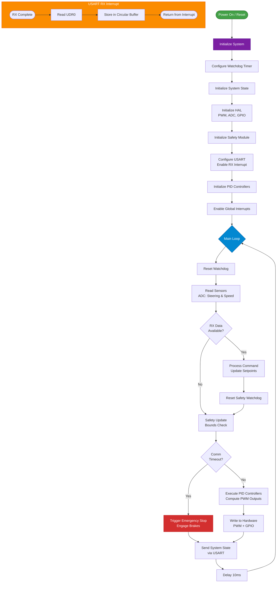

# Module 3 - Motion Control Firmware in gabriel-teleop-platform

# AVR-C

## **1. Architecture Overview**

The firmware implements a parallel execution model with modular components:

### **Module Structure**
- **interface.h** - System-wide constants and PID parameters
- **system_state.h/c** - SystemState struct definition and initialization
- **controller.h/c** - PID controller encapsulation and update logic
- **communication.h/c** - USART communication for command reception and state transmission
- **pid_controller.h/c** - Generic PID algorithm implementation
- **hal.h/c** - Hardware Abstraction Layer for PWM, ADC, and GPIO control
- **safety.h/c** - Safety monitoring and failsafe mechanisms
- **watchdog.h/c** - Watchdog timer configuration
- **pinout.h** - Pin definitions for ATmega328P
- **avr_c.ino** - Main firmware entry point and initialization

### **Firmware Flowchart**



### **Communication Protocol**
The firmware uses a command-based protocol with collision-resistant headers:
- `0xB5` (181) - Steering setpoint (2 bytes, little-endian, range: 0-18000)
- `0xB6` (182) - Acceleration setpoint (2 bytes, little-endian, range: 0-10000)
- `0xB7` (183) - Direction (1 byte: 0=forward, 1=reverse)
- `0xB8` (184) - Brakes (1 byte: 0=disengaged, 1=engaged)

**Command Format:**
```
Steering:     [0xB5] [Low Byte] [High Byte]
Acceleration: [0xB6] [Low Byte] [High Byte]
Direction:    [0xB7] [Value]
Brakes:       [0xB8] [Value]
```

**System State Response (17 bytes total):**
The firmware continuously transmits the system state as a binary packet:
- Bytes 0-2:   header (0xC3 0x3C 0xA5 unique sync pattern)
- Bytes 3-4:   steering_angle (uint16_t)
- Bytes 5-6:   steering_angle_setpoint (uint16_t)
- Bytes 7-8:   steering_manipulate_variable (uint16_t)
- Bytes 9-10:  acceleration (uint16_t)
- Bytes 11-12: acceleration_setpoint (uint16_t)
- Bytes 13-14: acceleration_manipulate_variable (uint16_t)
- Byte 15:     direction (uint8_t)
- Byte 16:     breaks (uint8_t)

**Protocol Design Notes:**
- Command headers (181-184) are chosen to avoid collision with maximum data values
- 3-byte sync pattern (0xC3 0x3C 0xA5) provides robust packet boundary detection
- Interrupt-driven RX with 16-byte circular buffer ensures reliable command reception
- Safety watchdog resets on each valid command reception

### **Execution Model**
The firmware operates with interrupt-driven communication and a main control loop:

**Initialization Sequence:**
1. Configure watchdog timer (64ms timeout)
2. Initialize system state to safe defaults
3. Initialize HAL (PWM @ 976Hz, ADC @ 125kHz, GPIO)
4. Initialize safety module
5. Configure USART (115200 baud, RX interrupt enabled)
6. Initialize PID controllers
7. Enable global interrupts

**Main Loop (10ms cycle):**
1. Reset watchdog timer
2. Read sensor values from ADC (steering angle, speed)
3. Check for incoming commands in RX buffer
4. Process commands and update setpoints (if available)
5. Execute safety checks (bounds validation, timeout monitoring)
6. Run PID controllers to compute control outputs
7. Write outputs to hardware (PWM for motors, GPIO for direction/brakes)
8. Transmit system state via USART
9. 10ms delay

**Interrupt Service Routine:**
- USART RX Complete interrupt stores incoming bytes in a 16-byte circular buffer
- Non-blocking reception allows main loop to continue execution

**Safety Features:**
- Communication timeout watchdog (1 second)
- Bounds checking on all sensor readings and setpoints
- Emergency stop engages brakes and stops all motion
- Failsafe mode activated on timeout or error conditions

---

## **2. Datasheet**

The Arduino Uno utilizes the **ATmega328P** 8-bit microcontroller. Detailed technical specifications, register maps, and electrical characteristics can be found in the official datasheet:
> [ATmega328P Datasheet](https://ww1.microchip.com/downloads/en/DeviceDoc/Atmel-7810-Automotive-Microcontrollers-ATmega328P_Datasheet.pdf)

> [AVR Libc Reference](https://avrdudes.github.io/avr-libc/avr-libc-user-manual/index.html) - Standard C library for AVR-GCC.

---

## **3. IDE**

> [Arduino IDE](https://www.arduino.cc/en/software/#ide) - Recommended for graphical development, debugging, and library management.

---

## **4. CLI**

While the Arduino IDE provides a graphical interface, the entire workflow—compilation, deploy, and serial testing—can be performed via the shell using the **Arduino CLI**.

---

### **4.1 Linux / macOS**

#### Commands
```bash
# 1. Install Arduino CLI
curl -fsSL https://raw.githubusercontent.com/arduino/arduino-cli/master/install.sh | sh

# 2. Setup Core for Arduino Uno (AVR architecture)
arduino-cli config init
arduino-cli core update-index
arduino-cli core install arduino:avr

# 3. Compile the Firmware and export binaries to a specific 'build' folder
# The FQBN (Fully Qualified Board Name) for Uno is arduino:avr:uno
arduino-cli compile --fqbn arduino:avr:uno --output-dir ./build module3-motion-control-firmware/avr_c

# 4. Deploy (Upload) to the Board
# Replace '/dev/ttyACM0' with your actual connected port (check with 'arduino-cli board list')
arduino-cli upload -p /dev/ttyACM0 --fqbn arduino:avr:uno --input-dir ./build

# 5. Serial Test (Monitor)
# Opens a serial communication session with the board
arduino-cli monitor -p /dev/ttyACM0 --config baudrate=9600
```

### **4.2 Windows**

#### Option A: Winget  
```powershell
winget install ArduinoSA.CLI
```

#### Option B: Scoop  
```powershell  
scoop install arduino-cli
```

#### Option C: Chocolatey  
```powershell  
choco install arduino-cli
```

#### Option D: MSI Installer:  
> [GitHub Releases](https://github.com/arduino/arduino-cli/releases)

#### Commands
```powershell
# 1. Setup Core for Arduino Uno
arduino-cli config init
arduino-cli core update-index
arduino-cli core install arduino:avr

# 2. Compile the Firmware and export binaries to a specific 'build' folder
# Ensure you are in the project root directory
arduino-cli compile --fqbn arduino:avr:uno --output-dir .\build module3-motion-control-firmware\avr_c

# 3. Deploy to the Board
# First, find your port (e.g., COM3) using: arduino-cli board list
# Replace 'COM3' below with your actual port
arduino-cli upload -p COM3 --fqbn arduino:avr:uno --input-dir .\build

# 4. Serial Test (Monitor)
arduino-cli monitor -p COM3 --config baudrate=9600
```

### **4.3 FreeBSD**

#### Commands
```sh
# 1. Install Arduino CLI

sudo pkg install arduino-cli

# 2. Setup Core
arduino-cli config init
arduino-cli core update-index
# NOTE: If this step fails to find FreeBSD tools, you must install 'avr-gcc' and 'avrdude' via pkg
# and configure the CLI to use system tools (advanced setup).
arduino-cli core install arduino:avr

# 3. Compile
arduino-cli compile --fqbn arduino:avr:uno --output-dir ./build module3-motion-control-firmware/avr_c

# 4. Deploy
# CHANGE: Port is /dev/cuaU0 (USB Serial usually starts here)
# PERMISSIONS: Ensure your user is in the 'dialer' group (pw groupmod dialer -m youruser)
arduino-cli upload -p /dev/cuaU0 --fqbn arduino:avr:uno --input-dir ./build

# 5. Serial Test
# CHANGE: Port is /dev/cuaU0
arduino-cli monitor -p /dev/cuaU0 --config baudrate=9600
```

---

## **5. Unit Tests**

The firmware includes automated unit tests written in Python using the `unittest` framework to verify serial communication and command processing with the motion control hardware.

### **5.1 Test Structure**

The test suite is located at:
```
module3-motion-control-firmware/tests/avr-c/test_firmware.py
```

**Test Class**: `TestMotionControlFirmware`
- Inherits from `unittest.TestCase`
- Contains 8 comprehensive test methods validating all aspects of firmware communication
- Uses `setUp()` and `tearDown()` for serial connection lifecycle management

### **5.2 Communication Protocol**

The test suite implements the complete command protocol:

**Command Headers** (from interface.h):
- `0xB5` (181) - Steering setpoint (2 bytes, little-endian, range: 0-18000)
- `0xB6` (182) - Acceleration setpoint (2 bytes, little-endian, range: 0-10000)
- `0xB7` (183) - Direction (1 byte: 0=forward, 1=reverse)
- `0xB8` (184) - Brakes (1 byte: 0=disengaged, 1=engaged)

**System State Response** (17 bytes):
- Bytes 0-2: Header (0xC3 0x3C 0xA5 - unique sync pattern)
- Bytes 3-4: steering_angle (uint16_t)
- Bytes 5-6: steering_angle_setpoint (uint16_t)
- Bytes 7-8: steering_manipulate_variable (uint16_t)
- Bytes 9-10: acceleration (uint16_t)
- Bytes 11-12: acceleration_setpoint (uint16_t)
- Bytes 13-14: acceleration_manipulate_variable (uint16_t)
- Byte 15: direction (uint8_t)
- Byte 16: breaks (uint8_t)

### **5.3 Test Methods**

#### **test_initial_state()**
Verifies firmware initializes to safe defaults:
- Steering setpoint: 9000 (center position)
- Acceleration setpoint: 0
- Brakes: engaged (1)

#### **test_steering_command()**
Tests steering commands with multiple values: [0, 9000, 18000, 4500, 13500]
- Sends command using `send_steering_command()`
- Reads system state and verifies `steering_angle_setpoint` matches
- Uses retry logic to handle asynchronous updates

#### **test_acceleration_command()**
Tests acceleration commands with values: [0, 2500, 5000, 7500, 10000]
- Sends command using `send_acceleration_command()`
- Verifies `acceleration_setpoint` updates correctly

#### **test_direction_command()**
Tests direction control (forward/reverse):
- Tests values: 0 (forward), 1 (reverse)
- Verifies `direction` field in system state

#### **test_brakes_command()**
Tests brake engagement/disengagement:
- Tests values: 0 (disengaged), 1 (engaged)
- Verifies `breaks` field in system state

#### **test_multiple_commands_sequence()**
Validates sequential command execution:
- Sends steering (9000), acceleration (5000), direction (1) in sequence
- Verifies all three fields update correctly
- Tests command processing reliability

#### **test_boundary_values()**
Tests all boundary conditions:
- Steering: 0, 18000
- Acceleration: 0, 10000
- Direction: 0, 1
- Brakes: 0, 1
- Uses subtests for granular failure reporting

#### **test_communication_timeout_safety()**
Validates failsafe mechanism:
1. Sends acceleration command (5000)
2. Waits 1.5 seconds (exceeds 1-second timeout)
3. Verifies firmware enters failsafe:
   - `breaks` = 1 (engaged)
   - `acceleration_manipulate_variable` = 0

### **5.4 Helper Methods**

#### **send_steering_command(value)**
```python
packet = struct.pack('<BH', CMD_HEADER_STEERING, value)
```
- Validates range: 0-18000
- Formats as little-endian: [Header][Low Byte][High Byte]

#### **send_acceleration_command(value)**
```python
packet = struct.pack('<BH', CMD_HEADER_ACCELERATION, value)
```
- Validates range: 0-10000
- Formats as little-endian

#### **send_direction_command(direction)**
```python
packet = struct.pack('<BB', CMD_HEADER_DIRECTION, direction)
```
- Validates: 0 or 1

#### **send_brakes_command(brakes)**
```python
packet = struct.pack('<BB', CMD_HEADER_BRAKES, brakes)
```
- Validates: 0 or 1

#### **read_system_state()**
Advanced packet synchronization logic:
1. Flushes serial buffer to discard stale packets
2. Waits 25ms for fresh firmware cycle (10ms loop + margin)
3. Reads and discards first packet (may be partial)
4. Waits 15ms and reads second packet
5. Searches for 0xC3 0x3C 0xA5 sync pattern (byte-by-byte)
6. Unpacks 14 bytes: `<HHHHHHBB` (6 × uint16 + 2 × uint8)
7. Returns dictionary with all system state fields

### **5.5 Running Tests**

#### Prerequisites
```bash
# Install dependencies (pyserial)
pip install -r requirements.txt
```

#### Run all tests with verbose output
```bash
python -m unittest discover -s module3-motion-control-firmware/tests/avr-c -v
```

#### Run specific test
```bash
python -m unittest module3-motion-control-firmware.tests.avr-c.test_firmware.TestMotionControlFirmware.test_steering_command
```

#### Example output
```
test_acceleration_command (__main__.TestMotionControlFirmware) ... ok
test_boundary_values (__main__.TestMotionControlFirmware) ... ok
test_brakes_command (__main__.TestMotionControlFirmware) ... ok
test_communication_timeout_safety (__main__.TestMotionControlFirmware) ... ok
test_direction_command (__main__.TestMotionControlFirmware) ... ok
test_initial_state (__main__.TestMotionControlFirmware) ... ok
test_multiple_commands_sequence (__main__.TestMotionControlFirmware) ... ok
test_steering_command (__main__.TestMotionControlFirmware) ... ok

----------------------------------------------------------------------
Ran 8 tests in 15.234s

OK
```

### **5.6 Configuration**

Update the `PORT_NAME` constant in `test_firmware.py` to match your system:
- **Linux/macOS**: `/dev/ttyUSB0` or `/dev/ttyACM0`
- **Windows**: `COM3`, `COM5`, etc. (default: `COM5`)
- **FreeBSD**: `/dev/cuaU0`

**Serial Parameters**:
- Baud Rate: 115200
- Timeout: 2 seconds